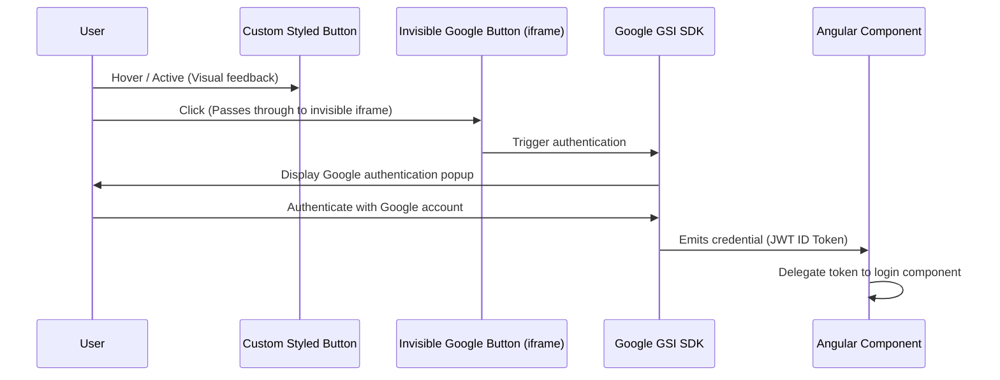

# Technical Report: Google Sign-In Implementation & Custom Styling

This report provides a complete technical overview of the "Sign in with Google" implementation in the Emotra application. It details how the integration is structured, how the code functions, and the security/layout pitfalls encountered when designing a custom style.

---

## 1. Core Architecture & Workflow

The integration uses the modern **Google Identity Services (GSI)** JavaScript SDK (`https://accounts.google.com/gsi/client`) to authenticate users.



### The Overlay Technique
Google Identity Services forces the button to render inside a secure `<iframe>` hosted on Google's domain. This means:
* Custom CSS cannot style the contents of the iframe.
* Standard click triggers (like programmatically clicking the button using JS) are blocked by browser security policies.

To bypass these limitations while retaining full visual branding control, we use an **Invisible Overlay Technique**:
1. We draw a **100% custom-styled button** using HTML and Tailwind CSS that matches our application design theme.
2. We place Google's official rendering container (`#googleBtnContainer`) **directly on top** of the custom button as an absolute overlay (`absolute inset-0`).
3. We set the overlay opacity to transparent (`opacity: 0`).
4. **Result:** The user *sees* and hovers over our beautiful custom button, but when they *click*, their click passes into the invisible Google iframe sitting directly above it, triggering the authentic popup.

---

## 2. Code Breakdown

### A. Template: `google-button.component.html`
[google-button.component.html](file:///c:/Users/Ahmed%20Mahmoud/Desktop/Graduation%20Project/Project%20Website/src/app/shared/components/form/google-button/google-button.component.html)

```html
<div class="w-full flex flex-col items-center">
  <!-- Parent Wrapper (Forces height and clips overflow) -->
  <div class="relative w-full max-w-[400px] h-10 mx-auto group rounded-[14px] overflow-hidden" 
       [class.opacity-50]="disabled()" 
       [class.pointer-events-none]="disabled()">
    
    <!-- Custom Styled Google Button (Visible, but clicks disabled) -->
    <button type="button" class="google-btn pointer-events-none">
      <svg class="w-[20px] h-[20px]" viewBox="0 0 24 24">
        <path d="M22.56 12.25c0-.78-.07-1.53-.2-2.25H12v4.26h5.92c-.26 1.37-1.04 2.53-2.21 3.31v2.77h3.57c2.08-1.92 3.28-4.74 3.28-8.09z" fill="#4285F4" />
        <path d="M12 23c2.97 0 5.46-.98 7.28-2.66l-3.57-2.77c-.98.66-2.23 1.06-3.71 1.06-2.86 0-5.29-1.93-6.16-4.53H2.18v2.84C3.99 20.53 7.7 23 12 23z" fill="#34A853" />
        <path d="M5.84 14.09c-.22-.66-.35-1.36-.35-2.09s.13-1.43.35-2.09V7.07H2.18C1.43 8.55 1 10.22 1 12s.43 3.45 1.18 4.93l2.85-2.22.81-.62z" fill="#FBBC05" />
        <path d="M12 5.38c1.62 0 3.06.56 4.21 1.64l3.15-3.15C17.45 2.09 14.97 1 12 1 7.7 1 3.99 3.47 2.18 7.07l3.66 2.84c.87-2.6 3.3-4.53 6.16-4.53z" fill="#EA4335" />
      </svg>
      <span>Continue with Google</span>
    </button>
    
    <!-- Real Google Button Overlay (Invisible but intercepts clicks) -->
    <div #googleBtnContainer class="google-iframe-container absolute inset-0 opacity-0 z-10 cursor-pointer"></div>
  </div>

  <!-- Trouble Signing In / Ad-blocker helper banner -->
  @if (scriptFailedToLoad) {
    <!-- ... Fallback Warning UI ... -->
  } @else {
    <!-- ... Troubleshooting instructions Toggle ... -->
  }
</div>
```

---

### B. Logic: `google-button.component.ts`
[google-button.component.ts](file:///c:/Users/Ahmed%20Mahmoud/Desktop/Graduation%20Project/Project%20Website/src/app/shared/components/form/google-button/google-button.component.ts)

The logic controls the lifecycle of the SDK script and renders the button dynamically:

1. **Script Initialization (`initGoogleButton`)**:
   Checks if the global `google` SDK object exists. If not, it dynamically appends the SDK script (`https://accounts.google.com/gsi/client`) to the document header. It polls every `100ms` until loaded.
2. **Dynamic Rendering (`renderGoogleButton`)**:
   Calculates the dynamic container width (bounded between Google's limits of `250px` and `400px`). It then calls `google.accounts.id.renderButton` to inject the official iframe into the `#googleBtnContainer` element.
3. **Theme Synchronization**:
   Uses an Angular `effect` linked to the `ThemeService` to automatically re-render the button configurations (`theme: isDark ? 'filled_black' : 'outline'`) whenever the theme changes, ensuring correct dark/light styling.
4. **Resize Safety (`setupResizeListener`)**:
   Listens to window resize events to recalculate the width and re-render the Google button, maintaining responsiveness.

---

### C. Stylesheet: `styles.css`
[styles.css](file:///c:/Users/Ahmed%20Mahmoud/Desktop/Graduation%20Project/Project%20Website/src/styles.css#L444-L476)

Styles are defined globally in `styles.css` inside the `@layer components` section:

```css
.google-btn {
  height: 100%;
  width: 100%;
  border-radius: 14px;
  border: 1px solid var(--border-color);
  background: transparent;
  color: var(--text-primary);
  font-weight: 600;
  display: flex;
  align-items: center;
  justify-content: center;
  gap: 12px;
  transition: all 200ms ease;
}

[data-theme="dark"] .google-btn {
  background: rgba(255, 255, 255, 0.05);
}

/* Hover & Active triggers on the parent .group wrapper */
.group:hover .google-btn {
  background-color: var(--bg-hover) !important;
}
[data-theme="dark"] .group:hover .google-btn {
  background-color: rgba(255, 255, 255, 0.1) !important;
}
.group:active .google-btn {
  transform: scale(0.98);
}
```

---

## 3. History of Pitfalls & Solutions

During development, three major issues were encountered and resolved:

### Pitfall 1: Click Spillage (Clicking outside the button triggered login)
* **What was wrong:** The parent container was set to `h-14` (56px) while Google's large sign-in button defaults to a fixed height of `40px`. Since they didn't match, the transparent iframe had a 16px vertical gap. Also, on narrow screens, the container would scale down but the Google button was rendered at a fixed `400px` width. The invisible iframe overflowed the boundaries of the visible button, letting users click the "empty space" next to the button to trigger sign-in.
* **The Solution:** We set the container height to exactly match Google's button height (`h-10` / 40px) and set the custom button height to `100%`. We also added `overflow-hidden` and `rounded-[14px]` on the parent container to clip the iframe's corners and overflow.

### Pitfall 2: Clickjacking Block (Overlay was unclickable in deployment)
* **What was wrong:** We wrote CSS overrides to force `width: 100% !important; height: 100% !important;` directly on the child `iframe` elements inside `.google-iframe-container`.
* Google's iframe has built-in **clickjacking protection**. In production (served over HTTPS), Google's internal scripts check if the iframe has been resized, redressed, or has low opacity. When it detected that the iframe was styled with invasive CSS properties, it blocked all mouse click and hover handlers. (This passed locally because Google relaxes clickjacking protections on `localhost`).
* **The Solution:** We removed all CSS dimension overrides on the iframe. Instead, we configure Google's button width natively via the `width: buttonWidth` configuration argument in the `renderButton` method.

### Pitfall 3: Popup Redirect Mismatch (`redirect_uri_mismatch`)
* **What was wrong:** We tried to bypass the overlay technique by implementing a standard JavaScript `window.open()` callback popup pointing directly to Google's OAuth2 authorization endpoints.
* **The problem:** This redirect flow requires you to register the callback page (e.g. `http://localhost:4200/google-callback.html`) inside the Authorized Redirect URIs settings in the Google Cloud Developer Console. If this isn't configured, Google blocks access with an `Error 400: redirect_uri_mismatch`.
* **The Solution:** Reverted back to Google's standard GSI client rendering flow (`google.accounts.id`). Because this flow handles credentials internally, it operates without needing to configure or maintain Redirect URIs in Google Cloud Console.

---

## 4. Summary of the Final Solution

The current implementation is robust, compliant, and works out-of-the-box in both development and production:
1. It uses a **40px height** boundary (`h-10`) that aligns perfectly with Google's large button.
2. It uses **`overflow-hidden`** to prevent click spillage outside the custom button's border.
3. It utilizes **Google GSI SDK** standard initialization to avoid origin redirect blocks.
4. **Opacity is set to 0** on the overlay container, but no overrides are placed on the iframe itself, keeping Google's security checks satisfied.
