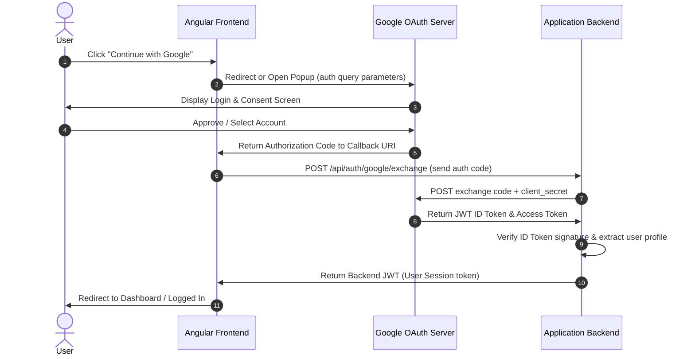

# Google Sign-In: How It Works

This report provides a clear, concise overview of how Google Sign-In (OAuth 2.0 & OpenID Connect) functions, covering its frontend appearance, the step-by-step interaction flow, and the endpoints used.

---

## 1. How It Looks in the Frontend

Depending on the implementation, the Google Sign-In frontend element typically takes one of two forms:

1. **Official Google Sign-In Button (Iframe):**
   * Generated dynamically via the Google Identity Services (GSI) library (`https://accounts.google.com/gsi/client`).
   * Renders inside a secure `<iframe>` hosted by Google. It has standard branding, customizable sizing, and hover effects.
   * **Behavior:** Clicking it automatically opens a secure Google Login popup window or prompts the user with "One Tap" login if they are already logged in to Google.

2. **Custom-Styled Button:**
   * A completely custom button designed with HTML/CSS (e.g., matching the app's dark/light theme).
   * **Behavior:** When clicked, it either triggers a popup using JavaScript (`google.accounts.id.prompt()`) or redirects the browser directly to Google's Authorization server.

---

## 2. Step-by-Step Flow (Authorization Code Flow)

For modern Single Page Applications (SPAs) like Angular or React, the **Authorization Code Flow** is the standard and most secure approach.

Here is what happens when a user clicks the **"Continue with Google"** button:

### Flow Walkthrough
1. **User Interaction**: The user clicks the button.
2. **Redirect to Google**: The browser redirects (or opens a popup) to Google's authorization page, passing configuration parameters (Client ID, Redirect URI, Scope, State).
3. **Authentication**: The user logs into Google (if not already) and consents to sharing their profile info (email, name, picture).
4. **Authorization Code Received**: Google redirects the browser back to the app's frontend callback URL with a temporary **Authorization Code** (a short-lived string).
5. **Backend Request**: The frontend grabs this code and sends a `POST` request containing the code to the backend.
6. **Code Exchange**: The backend sends this code along with the **Client Secret** (kept secret from the frontend) to Google's token endpoint to exchange it for tokens.
7. **Tokens Returned**: Google returns an **ID Token** (a cryptographically signed JSON Web Token containing user info) and an **Access Token**.
8. **Token Verification**: The backend verifies the ID token's signature using Google's public certificates. Once verified, it finds or creates the user in the database.
9. **Session Issued**: The backend creates its own JWT (session token) and returns it to the frontend, completing the login.

---

## 3. Endpoints Used

Below are the primary Google and backend endpoints called during this authentication cycle:

### A. Google OAuth 2.0 Authorization Endpoint
* **URL:** `https://accounts.google.com/o/oauth2/v2/auth`
* **HTTP Method:** `GET`
* **Triggered by:** Frontend (opening the popup or redirecting the browser).
* **Key Query Parameters:**
  * `client_id`: Identifies the application.
  * `redirect_uri`: The URL Google sends the code to.
  * `response_type=code`: Tells Google to return an authorization code.
  * `scope=openid email profile`: The data the app is requesting access to.

### B. Google Token Exchange Endpoint
* **URL:** `https://oauth2.googleapis.com/token`
* **HTTP Method:** `POST`
* **Triggered by:** Backend (backend-to-backend request).
* **Payload (x-www-form-urlencoded):**
  * `code`: The authorization code from the frontend.
  * `client_id` & `client_secret`: Backend credentials.
  * `grant_type=authorization_code`: The type of exchange.
  * `redirect_uri`: Must match the original frontend callback URI.

### C. Google Public Certificate Endpoint
* **URL:** `https://www.googleapis.com/oauth2/v3/certs`
* **HTTP Method:** `GET`
* **Triggered by:** Backend (cached dynamically).
* **Purpose:** Provides Google's public signing keys so the backend can verify the integrity and signature of the returned `id_token` JWT.

### D. Google User Info Endpoint (Optional)
* **URL:** `https://openidconnect.googleapis.com/v1/userinfo`
* **HTTP Method:** `GET` (with Authorization header `Bearer ACCESS_TOKEN`)
* **Triggered by:** Backend (only if user profile info was not extracted directly from the verified `id_token` JWT).
* **Purpose:** Retrieves user profile metadata (name, profile picture, email).
