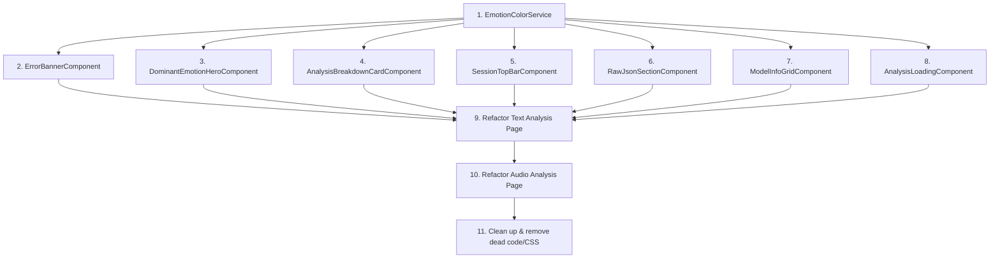

# 🏗️ Refactoring Plan: Shared Analysis Components

## Current Problem

| File | Lines | Size |
|------|-------|------|
| `audio-analysis.component.html` | 643 | ~40 KB |
| `audio-analysis.component.ts` | 626 | ~22 KB |
| `app-text-analysis.html` | 479 | ~30 KB |
| `text-analysis.component.ts` | 382 | ~15 KB |
| **Total** | **2,130** | **~107 KB** |

Both pages share massive chunks of near-identical HTML & TypeScript logic. This plan extracts **7 shared components**, **1 shared CSS file**, and **1 utility mixin** to eliminate duplication.

---

## 📊 Duplication Map

Below is a side-by-side mapping of the duplicated sections found in both files:

| # | Section | Text HTML Lines | Audio HTML Lines | Similarity |
|---|---------|-----------------|------------------|------------|
| 1 | **Dominant Emotion Hero** | 150–197 | 279–315 | ~85% — same layout, different data paths |
| 2 | **Results Top Bar (Session)** | 122–148 | 244–273 | ~90% — identical structure |
| 3 | **Emotion Timeline Section** | 199–231 | 339–357 | ~80% — same chart, different wrapper |
| 4 | **Emotion Distribution Section** | 233–285 | 359–382 | ~75% — text has extra "insights" panel |
| 5 | **Sentence/Segment Breakdown** | 349–410 | 438–497 | ~85% — identical card layout with mini-bars |
| 6 | **Raw JSON Collapsible** | 436–475 | 598–636 | ~95% — nearly copy-paste identical |
| 7 | **Model Info Chips** | 412–434 | 564–596 | ~80% — same chip layout |

### Duplicated TypeScript Logic

| Function | Text TS | Audio TS | Notes |
|----------|---------|----------|-------|
| `getEmotionColor()` | L261–267 | L550–556 | **Identical** |
| `highlightedJson()` | L350–366 | L570–582 | **Identical** |
| `copyJson()` | L368–373 | L564–568 | **Identical** |
| `copySessionId()` | L375–379 | L558–562 | **Identical** |
| `runLoadingSequence()` | L240–250 | L524–534 | **Identical** |
| `getSortedEmotions/Probs()` | L269–273 | L608–612 | **Identical** |
| `heroCardBg` (computed) | L135–140 | L137–142 | **~Identical** |

### Duplicated CSS

| Rule | Text CSS | Audio CSS |
|------|----------|-----------|
| `.section-header` | ✅ | ✅ duplicate |
| JSON syntax colors | ✅ | ✅ duplicate |
| `.info-chip` | ✅ (text only, should be shared) | ❌ inline in HTML |
| `.no-scrollbar` | ✅ | ❌ |

---

## 🎯 Proposed Shared Components

All new components will live under:
```
src/app/shared/components/analysis/
```

---

### Component 1: `DominantEmotionHeroComponent`

> [!IMPORTANT]
> You specified that the **text analysis style** should be the canonical style for this component. The text version's cleaner rounded-2xl card with confidence bar will be used as the base.

**Purpose:** The hero card showing the dominant emotion with icon, label, confidence %, category badge, and confidence bar.

```
📁 dominant-emotion-hero/
  ├── dominant-emotion-hero.component.ts
  ├── dominant-emotion-hero.component.html
  └── dominant-emotion-hero.component.css
```

**Inputs:**
```typescript
emotionLabel = input.required<string>();       // e.g. "joy"
confidencePercent = input.required<number>();   // e.g. 87.3
category = input.required<string>();           // e.g. "positive"
sectionTitle = input<string>('Dominant Emotion'); // "Dominant Emotion" or "Fused Modal Result"
showConfidenceBar = input<boolean>(true);      // text shows it, audio doesn't currently
truncationWarning = input<string | null>(null); // optional truncation message
```

**What it replaces:**
- Text HTML lines 150–197 (the entire `3.2 Dominant Emotion Hero` section)
- Audio HTML lines 279–315 (the hero card within the grid)

**Style:** Uses the **text analysis** style — `rounded-2xl`, clean card with `heroCardBg` gradient, confidence bar at bottom.

---

### Component 2: `SessionTopBarComponent`

**Purpose:** The results header with Session ID badge, copy button, and "← New Analysis" button.

```
📁 session-top-bar/
  ├── session-top-bar.component.ts
  └── session-top-bar.component.html
```

**Inputs & Outputs:**
```typescript
sessionId = input.required<string>();
newAnalysis = output<void>();   // emits when "← New Analysis" is clicked
```

**What it replaces:**
- Text HTML lines 122–148
- Audio HTML lines 244–273

---

### Component 3: `AnalysisBreakdownCardComponent`

**Purpose:** A single sentence/segment card with index badge, emotion label chip, confidence %, optional text/timestamp, and mini probability bars.

```
📁 analysis-breakdown-card/
  ├── analysis-breakdown-card.component.ts
  └── analysis-breakdown-card.component.html
```

**Inputs:**
```typescript
index = input.required<number>();
emotionLabel = input.required<string>();
confidence = input.required<number>();         // 0-1 scale
probabilities = input.required<Record<string, number>>();
sentence = input<string | null>(null);         // for text — shows blockquote
timestampOffset = input<number | null>(null);  // for audio — shows timestamp
intensityWeight = input<number | null>(null);  // weight badge
```

**What it replaces:**
- Text HTML lines 360–407 (each `*ngFor` iteration)
- Audio HTML lines 451–495 (each `*ngFor` iteration)

---

### Component 4: `RawJsonSectionComponent`

**Purpose:** Collapsible "Show Raw JSON" toggle with syntax-highlighted JSON and copy button.

```
📁 raw-json-section/
  ├── raw-json-section.component.ts
  ├── raw-json-section.component.html
  └── raw-json-section.component.css
```

**Inputs:**
```typescript
data = input.required<any>();   // the raw result object to display
```

**What it replaces:**
- Text HTML lines 436–475 + TS `highlightedJson()`, `copyJson()`, `showRaw`, `copiedJson`
- Audio HTML lines 598–636 + same TS functions

> [!TIP]
> This component fully encapsulates `showRaw`, `copiedJson`, `highlightedJson()`, and `copyJson()` — removing ~50 lines of TS from each parent.

---

### Component 5: `ModelInfoGridComponent`

**Purpose:** The flex-wrap grid of metadata chips (Model name, Processing Time, etc.).

```
📁 model-info-grid/
  ├── model-info-grid.component.ts
  ├── model-info-grid.component.html
  └── model-info-grid.component.css
```

**Inputs:**
```typescript
chips = input.required<{ label: string; value: string; mono?: boolean }[]>();
warningChip = input<{ label: string; value: string } | null>(null);
```

**What it replaces:**
- Text HTML lines 412–434
- Audio HTML lines 564–596

---

### Component 6: `AnalysisLoadingComponent`

**Purpose:** The loading state with progress bar and cycling step text.

```
📁 analysis-loading/
  ├── analysis-loading.component.ts
  └── analysis-loading.component.html
```

**Inputs:**
```typescript
progress = input.required<number>();
stepText = input.required<string>();
showBrainIcon = input<boolean>(false);   // text page shows brain icon
```

**What it replaces:**
- Text HTML lines 102–117 + TS `runLoadingSequence()`
- Audio HTML lines 216–239 + TS `runLoadingSequence()`

---

### Component 7: `ErrorBannerComponent`

**Purpose:** The dismissible error banner.

```
📁 error-banner/
  ├── error-banner.component.ts
  └── error-banner.component.html
```

**Inputs & Outputs:**
```typescript
message = input.required<string>();
dismissed = output<void>();
```

**What it replaces:**
- Text HTML lines 23–41
- Audio HTML lines 27–43

---

## 🧩 Shared Utility: `EmotionColorService`

Both components have **identical** `getEmotionColor()` methods. This should be extracted into a shared injectable service:

```
📁 src/app/core/services/emotion-color.service.ts
```

```typescript
@Injectable({ providedIn: 'root' })
export class EmotionColorService {
  getColor(label: string): string {
    const l = label?.toLowerCase() || 'neutral';
    if (l === 'positive') return 'var(--color-success)';
    if (l === 'negative') return 'var(--color-danger)';
    if (l === 'brain') return 'var(--color-brain)';
    return `var(--emotion-${l})`;
  }
}
```

Both parent components and all new shared components will inject this service instead of duplicating the function.

---

## 🎨 Shared CSS File

Create a shared analysis stylesheet to eliminate CSS duplication:

```
📁 src/app/shared/styles/analysis-shared.css
```

**Contents (merged from both):**
```css
.section-header { padding-left: 16px; border-left: 4px solid var(--brand-primary); }
.info-chip { display: flex; flex-direction: column; gap: 4px; padding: 12px 20px; border-radius: 16px; background: var(--bg-card); border: 1px solid var(--border-color); }
.truncated-chip { border-color: rgba(253,150,68,0.3); background: rgba(253,150,68,0.06); }
.no-scrollbar::-webkit-scrollbar { display: none; }
/* JSON syntax — theme aware */
::ng-deep .json-key   { color: var(--code-key);    }
::ng-deep .json-string { color: var(--code-string); }
::ng-deep .json-number { color: var(--code-number); }
::ng-deep .json-bool   { color: var(--code-bool);   }
::ng-deep .json-null   { color: var(--code-null);   }
```

Both page-level CSS files will import this instead of duplicating.

---

## 📐 Implementation Order

The dependency graph dictates this build order:



| Phase | Task | Est. Lines Saved |
|-------|------|-----------------|
| 1 | `EmotionColorService` + Shared CSS | ~40 lines TS, ~45 lines CSS |
| 2 | `ErrorBannerComponent` | ~30 lines per page |
| 3 | `DominantEmotionHeroComponent` | ~50 lines per page |
| 4 | `SessionTopBarComponent` | ~25 lines per page |
| 5 | `AnalysisBreakdownCardComponent` | ~60 lines per page |
| 6 | `RawJsonSectionComponent` | ~45 lines per page + ~30 lines TS |
| 7 | `ModelInfoGridComponent` | ~25 lines per page |
| 8 | `AnalysisLoadingComponent` | ~20 lines per page + ~15 lines TS |
| 9 | Wire into Text Analysis | — |
| 10 | Wire into Audio Analysis | — |
| 11 | Dead code cleanup | — |

---

## 📉 Expected Outcome

| Metric | Before | After (Est.) |
|--------|--------|-------------|
| `audio-analysis.html` | 643 lines | ~250 lines |
| `audio-analysis.ts` | 626 lines | ~400 lines |
| `text-analysis.html` | 479 lines | ~180 lines |
| `text-analysis.ts` | 382 lines | ~200 lines |
| **Total page code** | **2,130 lines** | **~1,030 lines** |
| Shared components (new) | 0 | 7 components (~600 lines) |
| **Net reduction** | — | **~500 lines eliminated** |

---

## ⚠️ Key Constraints

> [!IMPORTANT]
> - **Fully responsive** — all shared components must work flawlessly on mobile, tablet, and desktop
> - **Dynamic theme colors** — all color references must use CSS variables (`var(--emotion-*)`, `var(--brand-primary)`, etc.) and `color-mix()` — no hardcoded hex values
> - **Text analysis style is canonical** — for the Dominant Emotion Hero, the text page's `rounded-2xl` card with confidence bar is the reference design
> - **Angular Signal Inputs** — all new components will use `input()` / `input.required()` (Angular signal-based inputs)
> - **Standalone components** — all new components will be `standalone: true`

---

## ❓ Questions Before Implementation

1. **Should the `AnalysisLoadingComponent` include the `runLoadingSequence()` timer logic internally**, or should the parent still control the progress/step and just pass them as inputs? (I recommend: parent controls, component just displays)

2. **For the Dominant Emotion Hero — should the audio page also get the confidence bar** that the text page currently has? (I recommend: yes, for consistency)

3. **Should we keep the text page's "Emotional Insights" panel** (polarity, diversity, complexity) as part of the distribution section, or extract it into its own component too? It's currently text-only.

4. **Ready to proceed with Phase 1?** I'll start with the `EmotionColorService` + shared CSS, then build each component one at a time.
